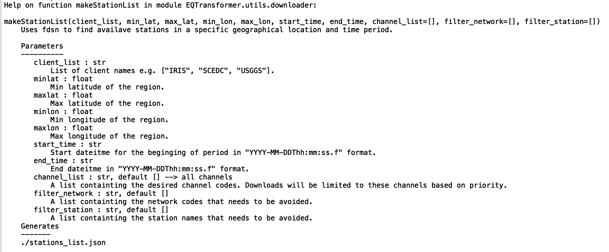
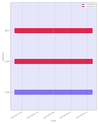
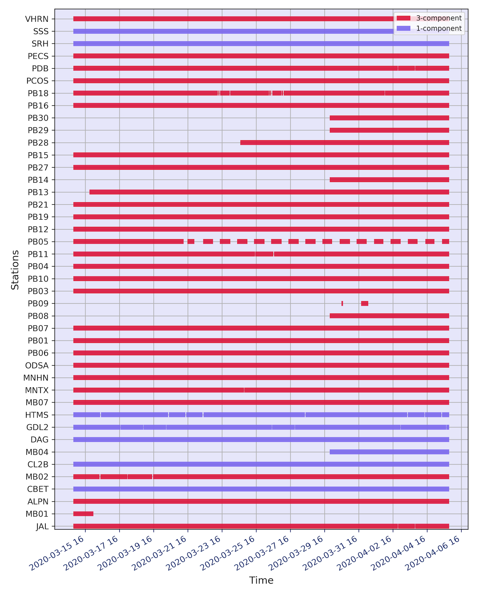
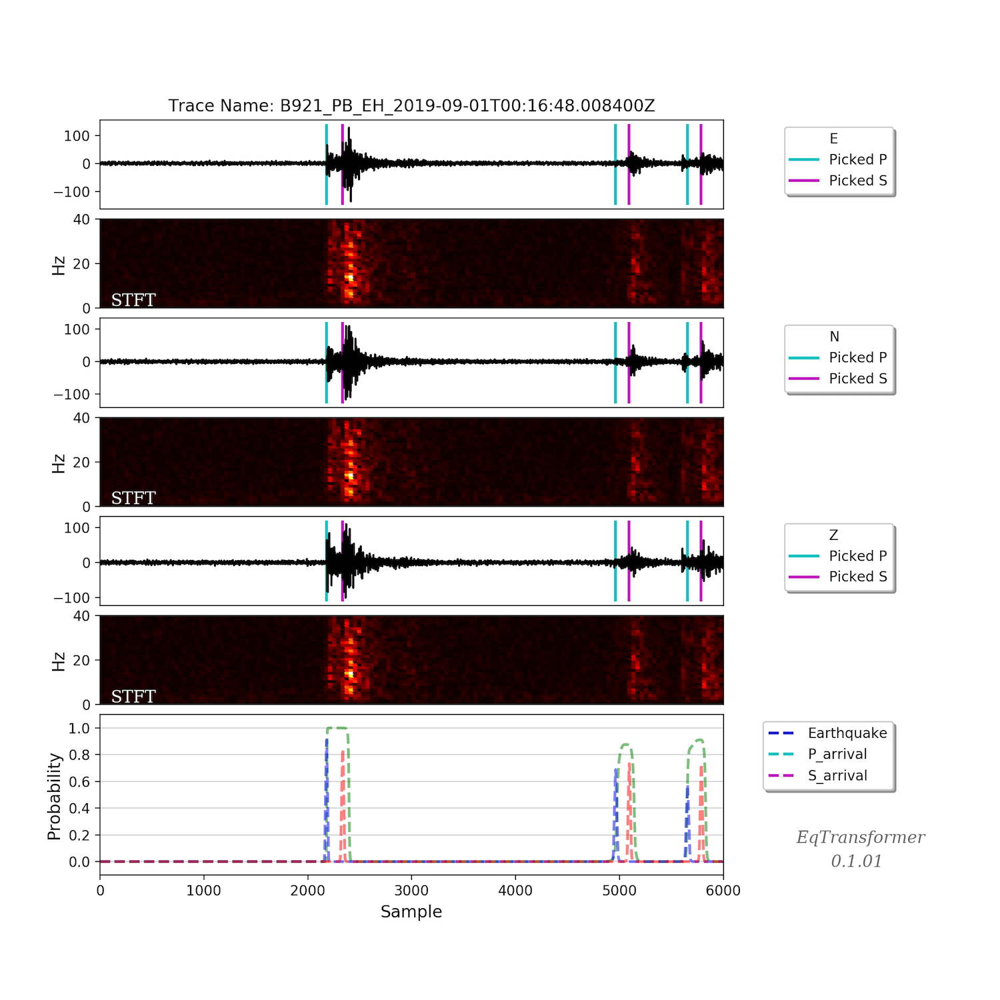
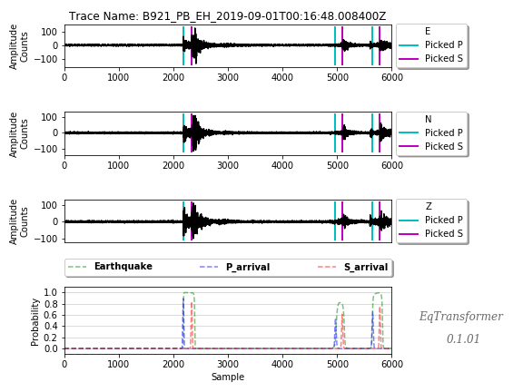
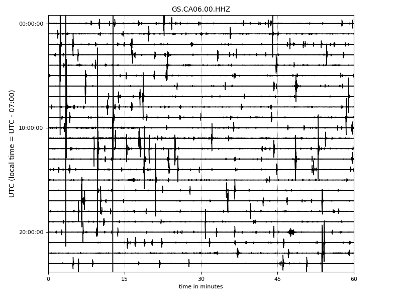
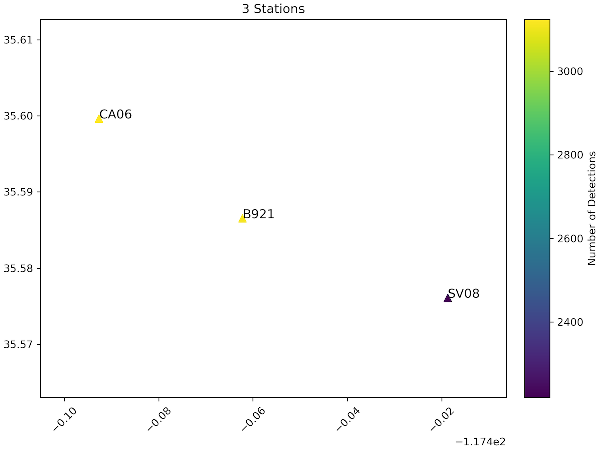
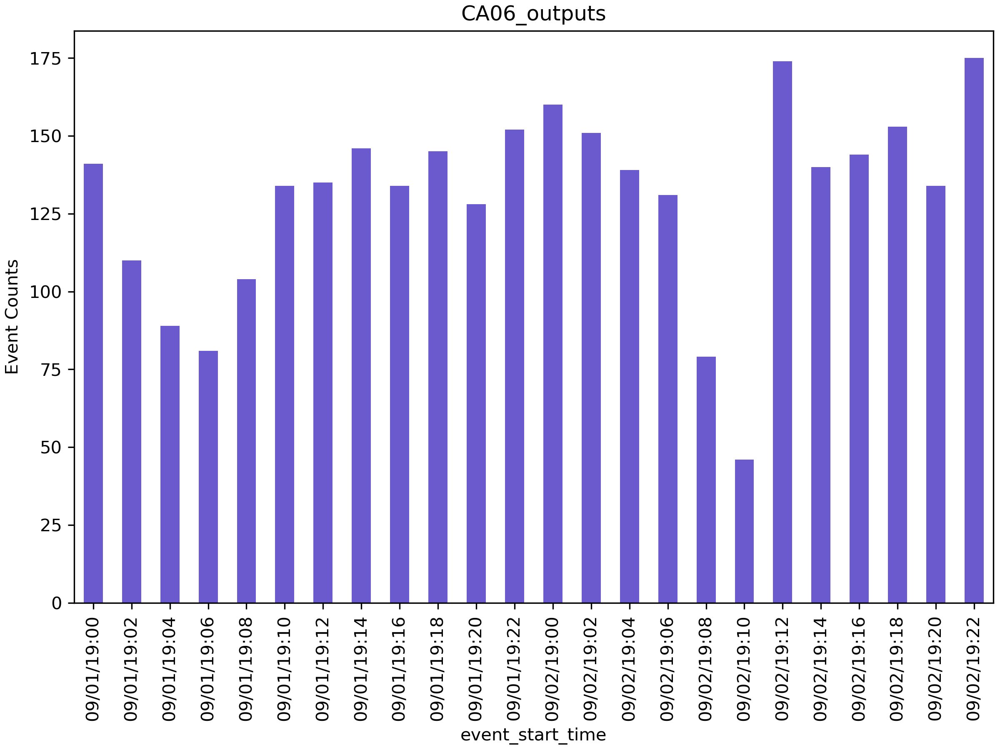

# Earthquake Transformer (EQTransformer or EqT) 

------

### Installation:

Open your terminal and type:

    pip install EQTransformer
    
Or download this repository, cd to EQTransformer and type:

    pip install requirements.txt
    
Note: if Opspy did not get installed using the above commends and you got error, try installing it separately based on the instruction here: https://github.com/obspy/obspy/wiki#installation

---------------------------

### Tutorial:

#### 1) Downloading some continuous data:

    from EQTransformer.utils.downloader import downloadMseeds, makeStationList

You can use help() to learn about input parameters of each fuunction.
For instance:

    help(makeStationList)

Defining the location and time period of interest

    MINLAT=35.50
    MAXLAT=35.60
    MINLON=-117.80
    MAXLON=-117.40
    STIME="2019-09-01 00:00:00.00"
    ETIME="2019-09-03 00:00:00.00"

You can limit your data types (e.g. broadband, short period, or strong motion) of interest  

    CHANLIST=["HH[ZNE]", "HH[Z21]", "BH[ZNE]", "EH[ZNE]", "SH[ZNE]", "HN[ZNE]", "HN[Z21]", "DP[ZNE]"]

This will download the information on the stations that are available based on your search criteria. 
You can filter out the networks or stations that you are not interested in, you can find the name of 
the appropriate client for your request from here: 

    makeStationList(client_list=["SCEDC"],  
                      min_lat=MINLAT,
                      max_lat=MAXLAT,
                      min_lon=MINLON, 
                      max_lon=MAXLON,                      
                      start_time=STIME, 
                      end_time=ETIME,
                      channel_list=CHANLIST,
                      filter_network=["SY"],
                      filter_station=[])
      
A jason file ("stataions_list.json") should have been created in your current directory.
This contains information for the available stations (i.e. 4 stations in this case).
Next, you can download the data for the available stations using the following function and script. 
This may take a few minutes.

    downloadMseeds(client_list=["SCEDC", "IRIS"], 
              stations_json='station_list.json', 
              output_dir="downloads_mseeds", 
              start_time=STIME, 
              end_time=ETIME, 
              min_lat=MINLAT, 
              max_lat=MAXLAT, 
              min_lon=MINLON, 
              max_lon=MAXLON,
              chunck_size=1,
              channel_list=[],
              n_processor=2)
    
Continuous data for each station should have been downloaded in your output directory (i.e. downloads_mseeds).

#### Note "if you already have your mseed files you can skip the previous steps and start from here"

#### 2) Data pre-processing:

To pre-process the continuous data and convert your mseed files into hdf5 file (the input of EQTransformer)

    from EQTransformer.utils.hdf5_maker import preprocessor
    preprocessor(mseed_dir='downloads_mseeds', 
                 stations_json='station_list.json', 
                 overlap=0.3,
                 n_processor=2)

After it finished you can see its report in "X_preprocessor_report.txt"
It will also generate one "station_name.hdf5" and one "station_name.csv" file for each of your stations and put them into a directory named "mseed_dir+_hdfs". The above script generates one pickle file ("time_tracks.pkl") that you can use it to visualize the continuity and type of your data using the following module:

    from EQTransformer.utils.plot import plot_data_chart
    plot_data_chart('time_tracks.pkl', time_interval=10)

This is another example for a longer priod and a larger network in west Texas:

#### 3) Performing the detection&picking:

Now you can perform the detection/picking using the following:
All you need is to pass the name of the directory containing your hdf5 & CSV files and a model. 
You can use very low threshold values for the detection and picking since EQTransformer is very robust to false positives. Enaibeling uncertaintiy estimation, outpur probabilities, or plotting all the predictions will slow down the process. 

    from EQTransformer.core.predictor import predictor
    predictor(input_dir= 'downloads_mseeds_processed_hdfs',   
             input_model='./sampleData&Model/EqT1D8pre_034.h5',
             output_dir='detections',
             estimate_uncertainty=False, 
             output_probabilities=False,
             number_of_sampling=5,
             loss_weights=[0.02, 0.40, 0.58],          
             detection_threshold=0.10,                
             P_threshold=0.02,
             S_threshold=0.02, 
             number_of_plots=100,
             plot_mode = 'time',
             batch_size=500,
             number_of_cpus=4,
             keepPS=False,
             spLimit=60) 

#### 4) Visualizing the Results:

Prediction outputs for each station will be written in your output directory (i.e. 'detections'). 
'X_report.txt' contains processing info on input parameters used for the detection/picking and final results such as running time, the total number of detected events (these are unique events and duplicated ones have been already removed).
'X_prediction_results.csv' contains detection/picking results in the figures folder you can find the plots for the number of events that you specified in the above comment.

You can choose between two different modes for your plots:

the 'time_frequency'

or 'time'

These plots are useful to check out if your defined thresholds are a good choice or if you get some false positives.

To check if you are missing too many events in the continuous data or catch most of them, it is always good to check out the raw data. You can do it using these commands:

First lesson of observational seismology: always check the raw data:

    from EQTransformer.utils.plot import plot_detections, plot_helicorder
    plot_helicorder(input_mseed='downloads_mseeds/CA06/GS.CA06.00.HHZ__20190902T000000Z__20190903T000000Z.mseed', 
                    input_csv=None, save_plot=True)
                    

Now you can mark all the detected events in your helicorder plot to check if you have catched most of them or you are missing too many of them (high false negativ). 

    plot_helicorder(input_mseed='downloads_mseeds/CA06/GS.CA06.00.HHZ__20190902T000000Z__20190903T000000Z.mseed', 
                    input_csv='detections/CA06_outputs/X_prediction_results.csv', save_plot=True)

You can also visulaize the number of detections over your network using this:

    plot_detections(input_dir ="detections",  input_json="station_list.json", plot_type='station_map', marker_size=50)

And this command will generate detection histograms for each station in your detection folder:

    plot_detections(input_dir ="detections",  input_json="station_list.json", plot_type='hist', time_window=120)

#### 5) Phase Association:

After detection, the following performs a simple and fast association and writes down the results in Hypoinverse format (Y2000.phs) which can directly be used to locate the detected earthquakes.
This is appropriate for a small number of stations located relatively close to each other.
This also outputs "traceNmae_dic.json", A dictionary where the trace name for all the detections associated with an event is listed. 
This can be used later to access the traces for calculating the cross-correlations during the relocation process.    

    import shutil
    import os
    from EQTransformer.utils.associator import run_associator
    out_dir = "asociation"
    try:
        shutil.rmtree(out_dir)
    except Exception:
        pass
    os.makedirs(out_dir) 
    run_associator(input_dir='detections', 
                   preprocessed_dir='downloads_mseeds_processed_hdfs', 
                   start_time=STIME, 
                   end_time=ETIME,
                   moving_window = 15,
                   pair_n = 3,
                   output_dir=out_dir,
                   double_checkinglen=False,
                   consider_combination=True)

This also outputs a file ('traceName_dic.json') which provides the list of trace names (the name of 1 min slices in the hdf5 files that were used as the input of the dector) for each associated event. This is useful for accessing to the raw waveforms of each event either for quality control, or for cross-correlation calculation, or magnitude estimation. 

#### 6) Building a new model:
You can also train the neural network on your data and build and test your own model using the following modules.
Your data should be in the same format as our sample data.  

    from EQTransformer.core.trainer import trainer
    trainer(input_hdf5='sampleData&Model/waveforms.hdf5',
            input_csv='test_data/metadata.csv',
            output_name='test_trainer',                
            cnn_blocks=2,
            lstm_blocks=1,
            padding='same',
            activation='relu',
            drop_rate=0.2,
            label_type='gaussian',
            add_event_r=0.6,
            add_gap_r=0.2,
            shift_event_r=0.9,
            add_noise_r=0.5, 
            mode='preload',
            train_valid_test_split=[0.60, 0.20, 0.20],
            batch_size=20,
            epochs=10, 
            patience=2,
            gpuid=None,
            gpu_limit=None)

    from EQTransformer.core.tester import tester
    tester(input_hdf5='sampleData&Model/waveforms.hdf5',
           input_testset='test_trainer_outputs/test.npy',
           input_model='test_trainer_outputs/models/test_trainer_001.h5',
           output_name='test_tester',
           detection_threshold=0.20,                
           P_threshold=0.1,
           S_threshold=0.1, 
           number_of_plots=3,
           estimate_uncertainty=True, 
           number_of_sampling=2,
           input_dimention=(6000, 3),
           normalization_mode='std',
           mode='generator',
           batch_size=10,
           gpuid=None,
           gpu_limit=None)   
