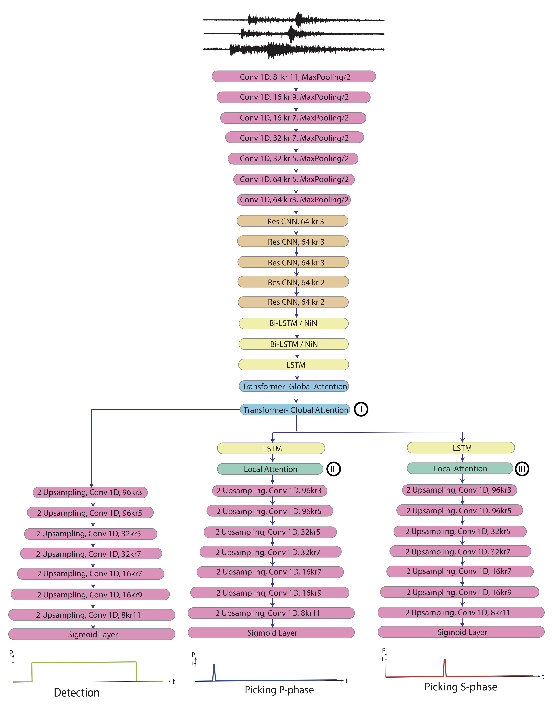
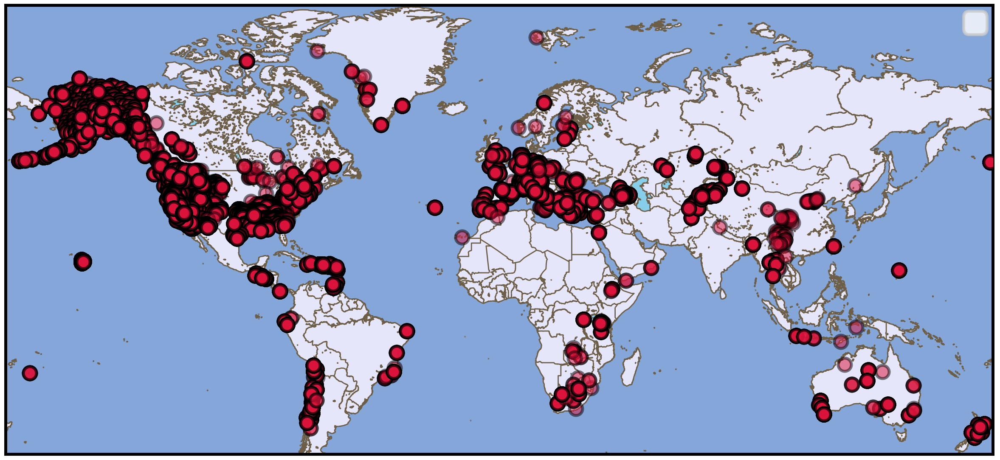
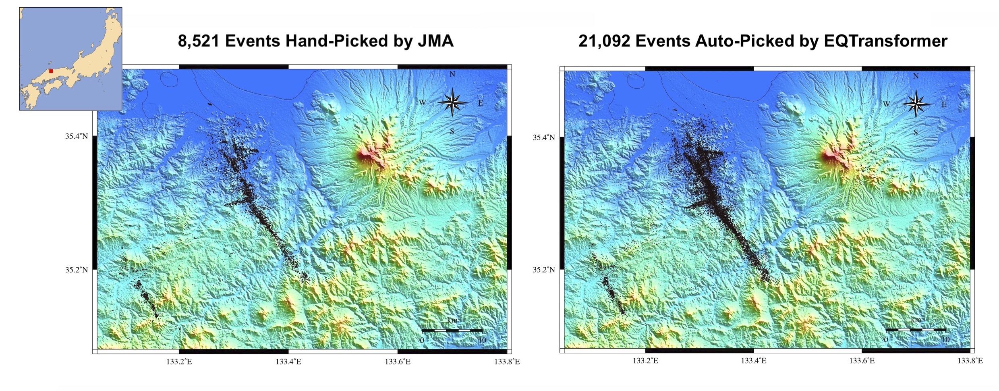
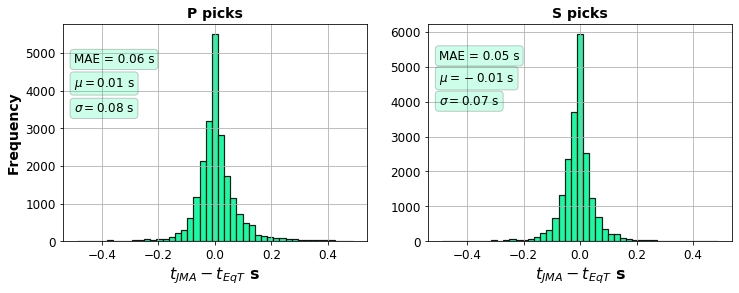
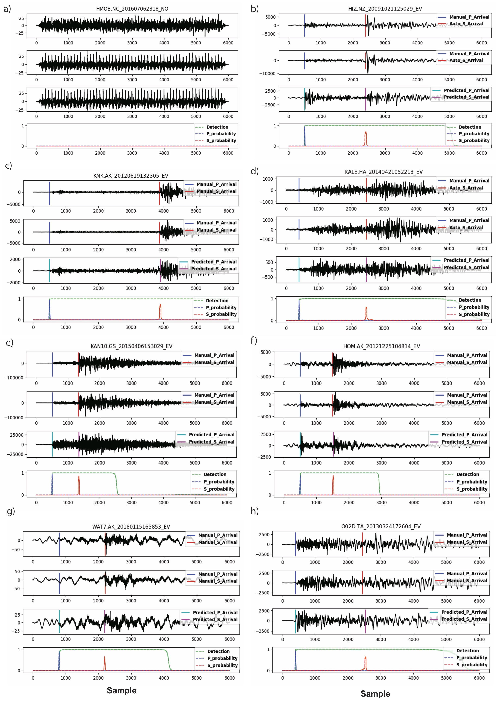
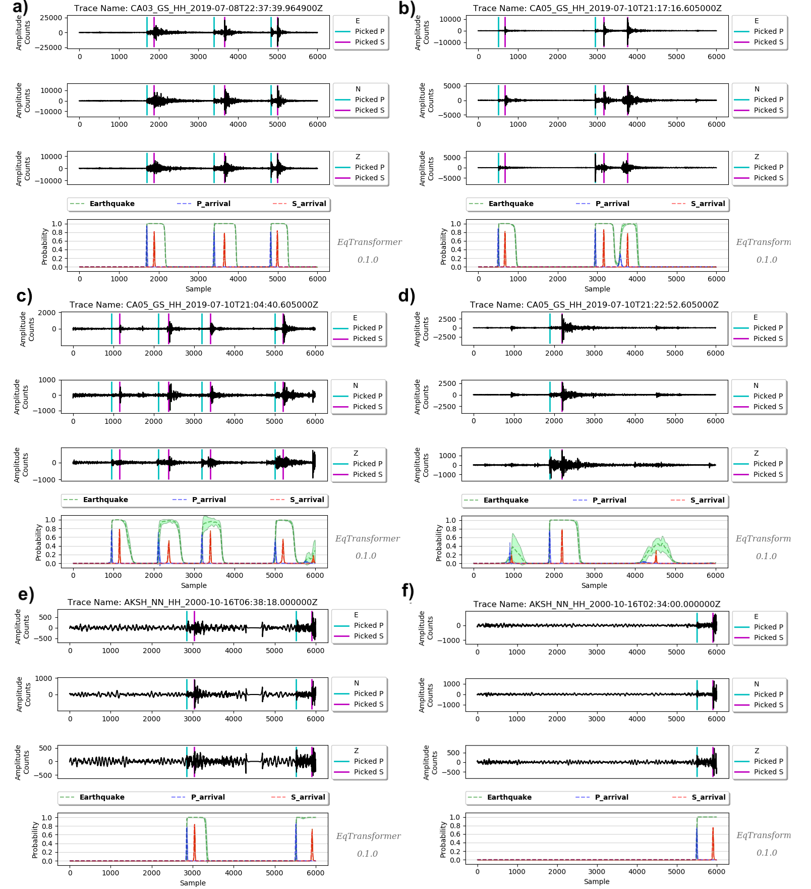
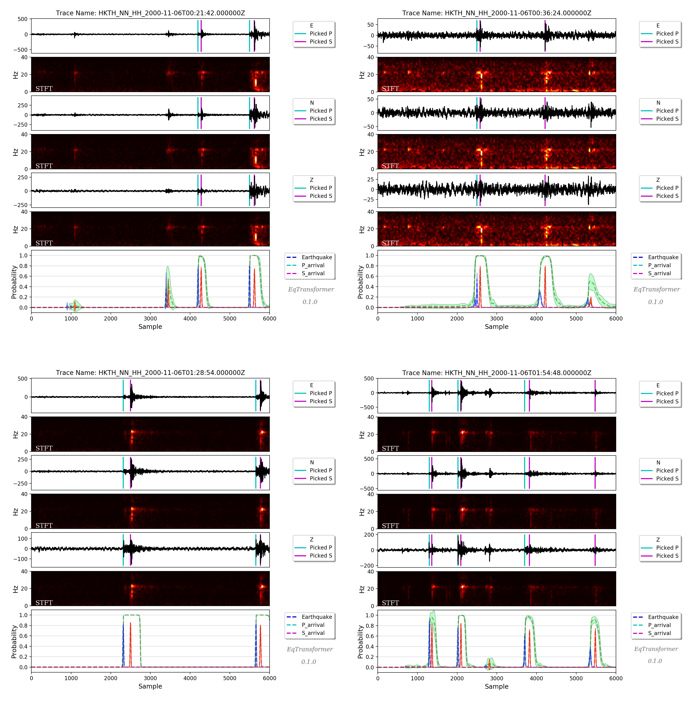
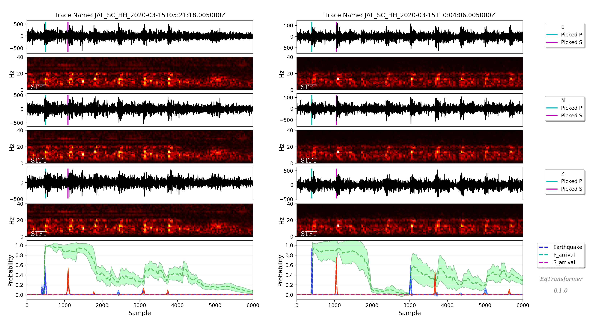
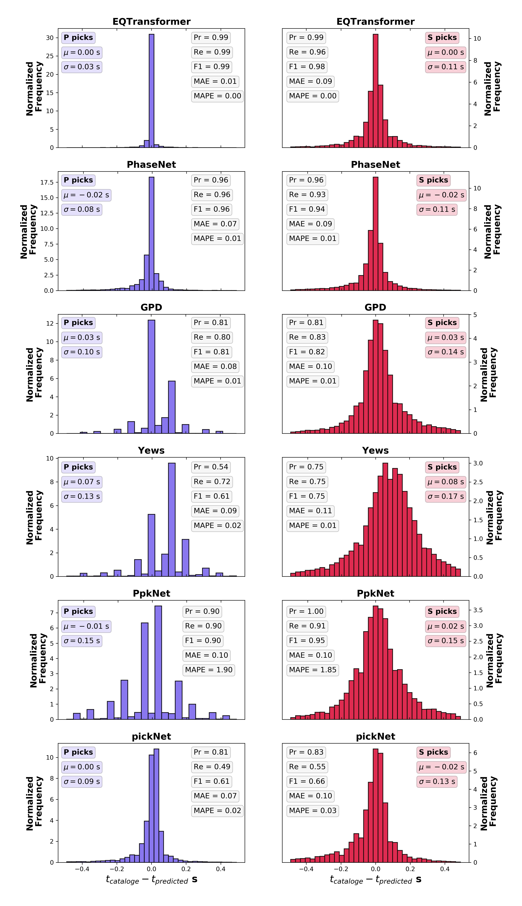
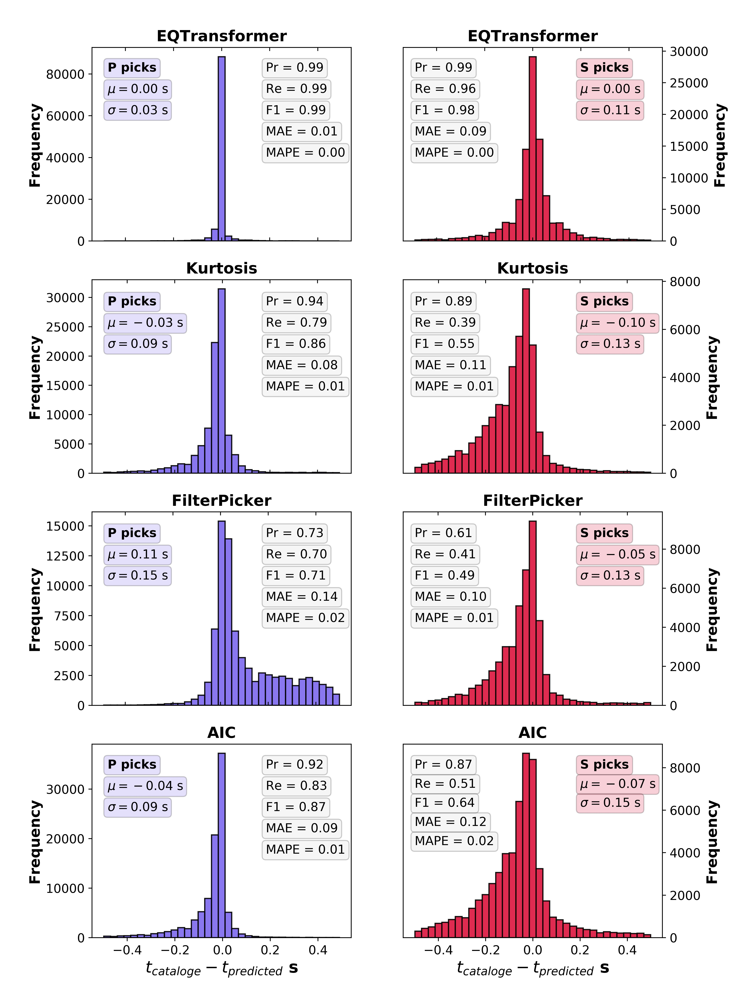

Overview
=====================

**EQTransformer** is a multi-task deep neural network for simultaneous earthquake detection and phase picking with a hierarchical attentive model. It mainly consists of one very deep encoder and three separate decoders (detector, P-picker, and S-picker branches) with an attention mechanism. Attention mechanisms in Neural Networks are inspired by human visual attention. Humans focus on a certain region of an image with high resolution while perceiving the surrounding image at low resolution and then adjusting the focal point over time. Our model emulates this through two levels of attention mechanism in a hierarchical structure. one at the global level for identifying an earthquake signal in the input time series, and one at the local level for identifying different seismic phases within that earthquake signal. Two levels of self-attention (global and local) help the neural network capture and exploit dependencies between local (individual phases) and global (full-waveform) features within an earthquake signal. This model has several distinctive characteristics: 1) it is the first hierarchical-attentive model specifically designed for earthquake signal; 2) with 56 activation layers, it is the deepest network that has been trained for seismic signal processing; 3) it has a multi-task architecture that simultaneously performs the detection and phase picking - using separate loss functions - while modeling the dependency of these tasks on each other through a hierarchical structure; 4) in addition to the prediction probabilities, it provides output variations based on Bayesian inference; 5) it is the first model trained using a globally distributed training set of 1.3 M local earthquake observations; 6) it consists of both convolutional and recurrent neurons. Read our paper for more details. 

Architecture of **EQTransformer**

Dataset
-------

`STanford EArthquake Dataset (STEAD) <https://ieeexplore.ieee.org/abstract/document/8871127/>`_ is used to train the **EQTransformer**. STEAD_ is a large-scale global dataset of labeled earthquake and non-earthquake signals. Here we used 1 M earthquake and 300 K noise waveforms (including both ambient and cultural noise) recorded by ~ 2600 seismic stations at epicentral distances up to 300 km. Earthquake waveforms are associated with about 450 K earthquakes with a diverse geographical distribution around the world. The majority of these earthquakes are smaller than M 2.5 and have been recorded within 100 km from the epicenter. A full description of properties of the dataset can be found in STEAD_. Waveforms are 1 minute long with a sampling rate of 100 Hz and are causally band-passed filtered from 1.0-45.0 Hz. 

STEAD_ contains earthquake signals from most of the seismically active countries with a few exceptions like Japan.

.. _STEAD: https://github.com/smousavi05/STEAD

Application to Japan
--------------------
However, **EQTransformer** has a high generalization ability. Applying it to 5 weeks of continuous data recorded during the 2000 Mw 6.6_ western Tottori_, Japan earthquake, two times more events were detected compared with the catalog of Japan Meteorological Agency (JMA). 

.. _6.6: https://pubs.geoscienceworld.org/ssa/bssa/article/93/4/1468/120827

.. _Tottori: https://www.google.com/maps/place/Tottori,+Japan/@35.4220364,133.9132257,10z/data=!3m1!4b1!4m5!3m4!1s0x355596c9a0846f89:0x3847638629e55456!8m2!3d35.5011082!4d134.2351011

In total, JMA's analysts picked 279,104 P and S arrival times on 57 stations, while EQTransformer was able to pick 401,566 P and S arrival-time on 18 of those stations (due to unavailability of data for other stations). To compare the manual picks by JMA with our automatic picks we used about 42,000 picks on the common stations and calculated the arrival time differences. The distributions of these arrival time differences between the manual and deep-learning picks for P and S waves are shown in the following figure. The standard deviation of differences between picks is around 0.08 second with a mean absolute error of around 0.06 second or 6 samples. The mean error is only 1 sample (0.01 s). 

Application to Other Regions
-----------------------------
Test set data from STEAD_:

Ridgecrest_, California:

.. _Ridgecrest: https://www.google.com/maps/place/Ridgecrest,+CA+93555/@35.6225618,-117.7312539,12z/data=!3m1!4b1!4m5!3m4!1s0x80c16cbc000c8aa5:0xdcb273036710aeba!8m2!3d35.6224561!4d-117.6708966

Tottori_, Japan:

West Texas_, USA:

.. _Texas: https://www.google.com/maps/place/West,+TX+76691/@31.8052808,-97.1087705,14z/data=!3m1!4b1!4m5!3m4!1s0x864f7566cf0ca5c7:0xfb25f7a61ca24545!8m2!3d31.8023057!4d-97.0909551

Variations in the output probability predictions (model uncertainty) can be useful to identify false-positive events (like the one shown in the above figure).

Comparison with Other Methods
----------------------------
Below are the picking errors for P and S waves. All methods have been applied to the same benchmark test set from STEAD_.

1) Comparing with some deep-learning pickers:

PhaseNet_, GPD_, Yews_, PpkNet_, pickNet_

.. _PhaseNet: https://academic.oup.com/gji/article/216/1/261/5129142
.. _GPD: https://pubs.geoscienceworld.org/ssa/bssa/article/108/5A/2894/546740/Generalized-Seismic-Phase-Detection-with-Deep
.. _Yews: https://www.sciencedirect.com/science/article/pii/S0031920118301407
.. _PpkNet: https://pubs.geoscienceworld.org/ssa/srl/article/90/3/1079/569837/Hybrid-Event-Detection-and-Phase-Picking-Algorithm
.. _pickNet: https://agupubs.onlinelibrary.wiley.com/doi/full/10.1029/2019JB017536

1) Comparing with some traditional pickers:

Kurtosis_, FilterPicker_, AIC_

.. _AIC: https://ci.nii.ac.jp/naid/10024498111/
.. _Kurtosis: https://ieeexplore.ieee.org/abstract/document/1020271
.. _FilterPicker: https://pubs.geoscienceworld.org/ssa/srl/article/83/3/531/143936
