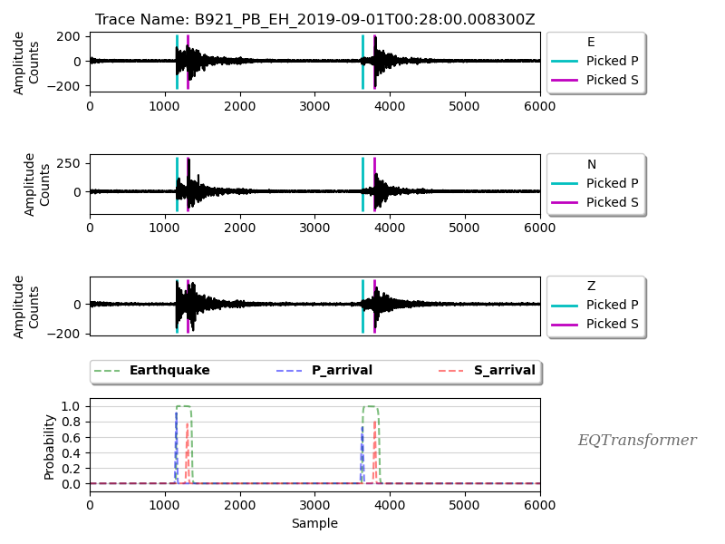
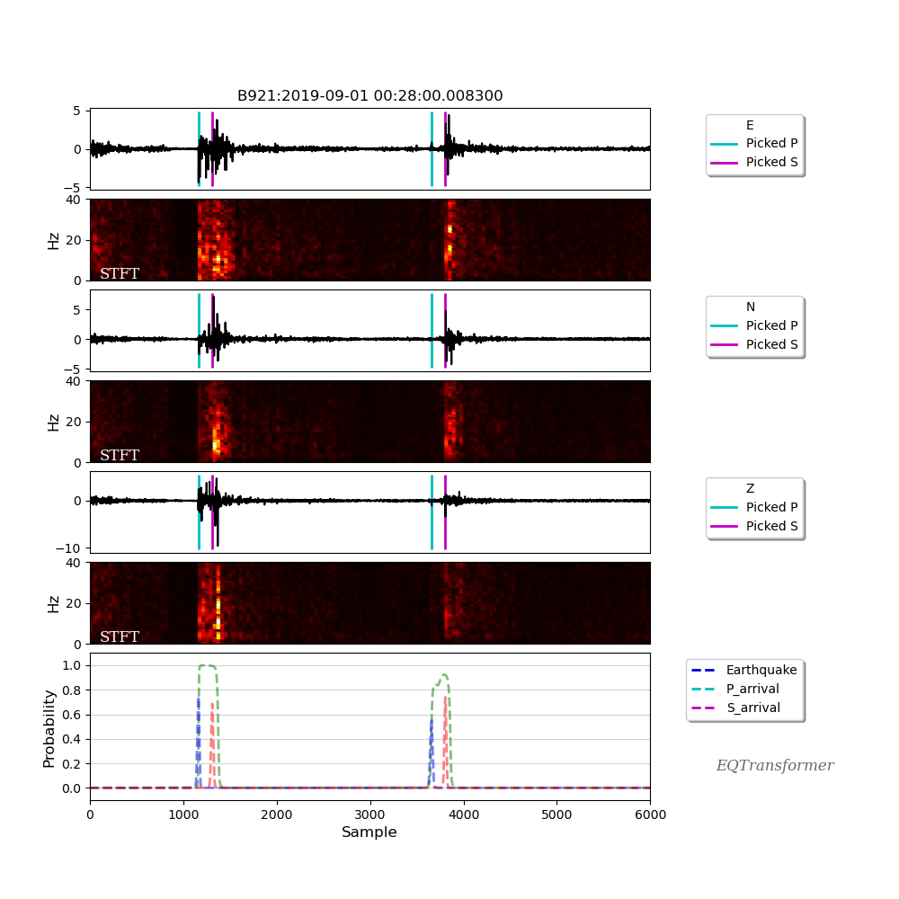
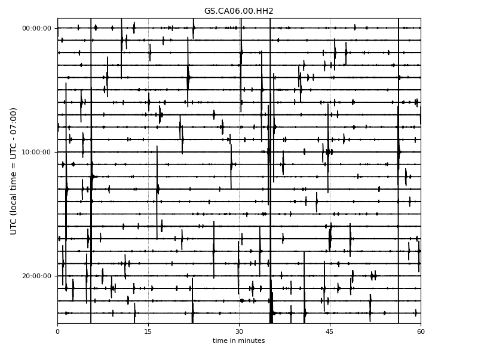
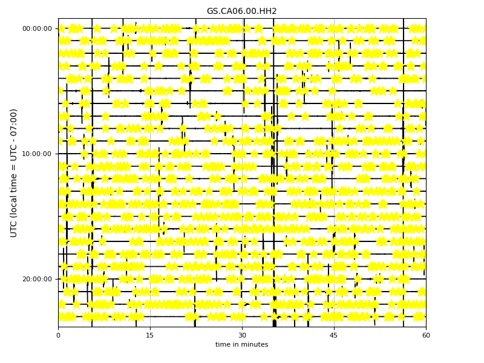
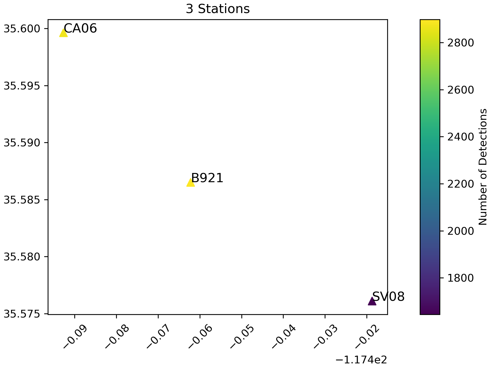
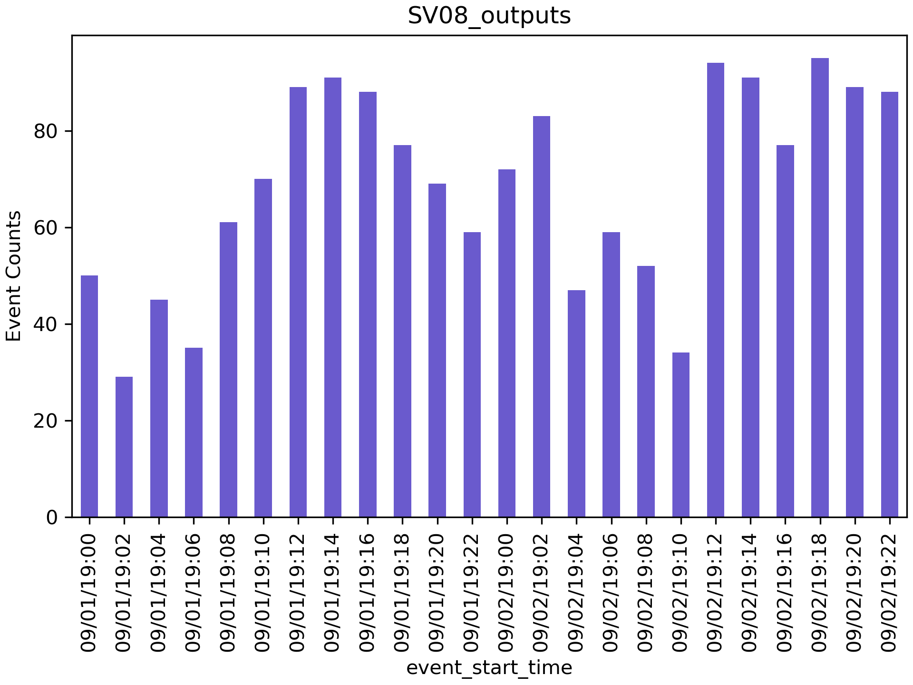
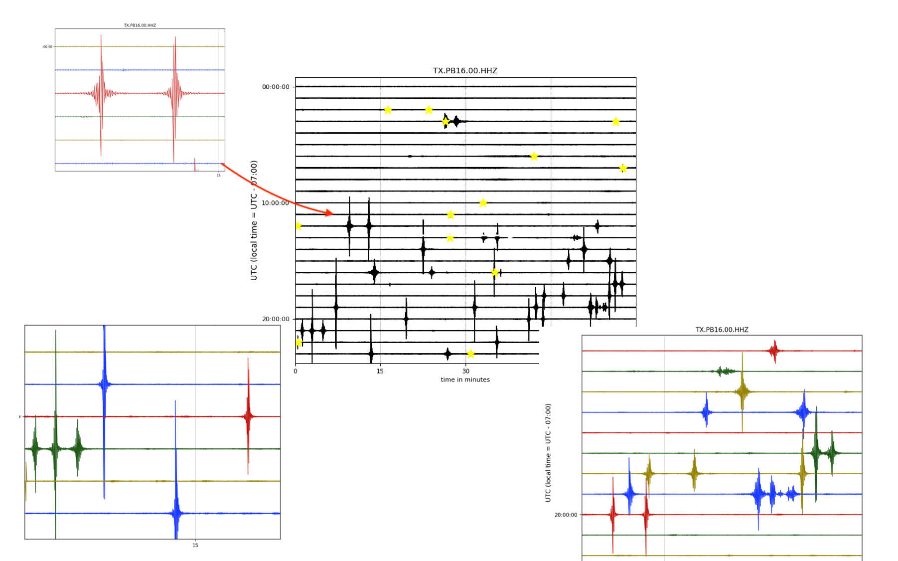
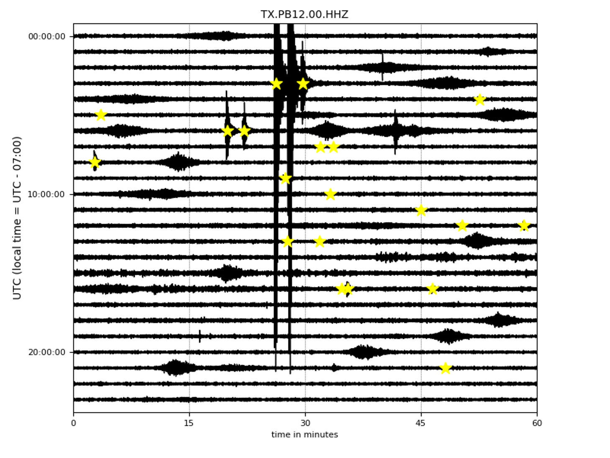
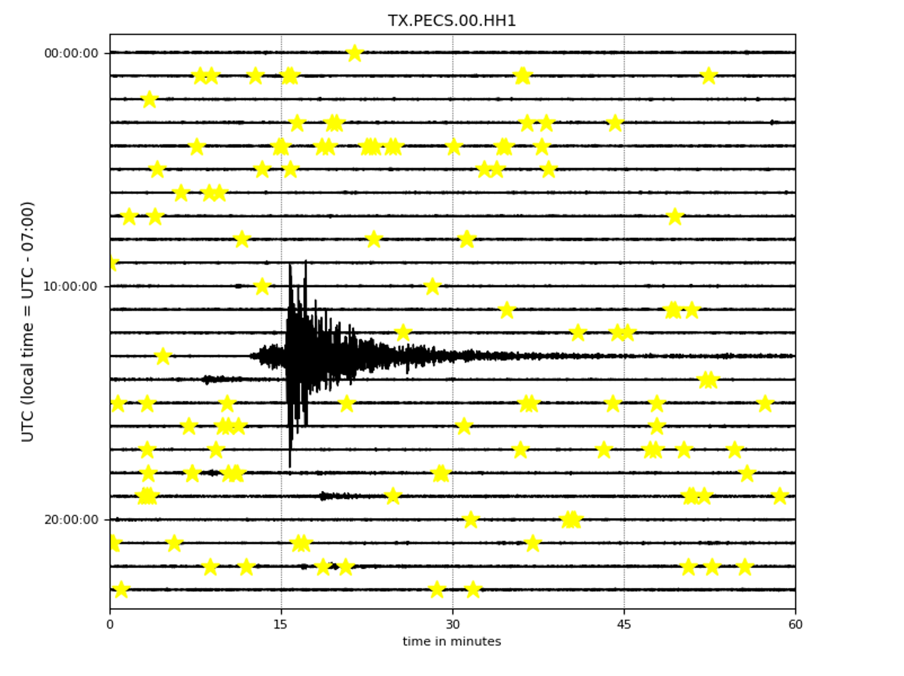

Tutorial
=========

**EQTransformer** package is divided into two main sub-modules, the ``core`` and ``utils`` sub-modules.

The ``core`` sub-module contains the main, high-level functions:

:trainer:
        It can be used to generate and train new **EQTransformer** models with different encoder depths. 
:tester:
        It is used to test a trained model using ground truth data.
:predictor:
        It is used to apply a pre-trained model to pre-processed continuous data.
:mseed_predictor:
        It is used to perform a fast detection & picking directly on continuous data in MiniSeed format.

The ``utils`` sub-module contains the main, high-level functions:

:downloader:
        It can be used to download continuous data from seismic networks. 
:hdf5_maker:
        It is used to pre-process the continuous data and slice it to 1-minute windows used by predictor module. 
:plot:
        It contains a few different methods to visualize the detection and downloading results.
:associator:
        Performs a simple phase association and output phase information for the associated events in HypoInverse input format.

Downloading Continuous Data
----------------------------

The following will download the information on the stations that are available based on your search criteria:
 
.. code:: python

    import os
    json_basepath = os.path.join(os.getcwd(),"json/station_list.json")
	
    from EQTransformer.utils.downloader import makeStationList
    
    makeStationList(json_path=json_basepath, client_list=["SCEDC"], min_lat=35.50, max_lat=35.60, min_lon=-117.80, max_lon=-117.40, start_time="2019-09-01 00:00:00.00", end_time="2019-09-03 00:00:00.00", channel_list=["HH[ZNE]", "HH[Z21]", "BH[ZNE]"], filter_network=["SY"], filter_station=[])

The above function will generate ``station_list.json`` file containing the station information. Next, you can use this file and download 1 day of data for the available stations at Ridgecrest, California from Southern California Earthquake Data Center or IRIS using the following:

.. code:: python

    from EQTransformer.utils.downloader import downloadMseeds
    
    downloadMseeds(client_list=["SCEDC", "IRIS"], stations_json=json_basepath, output_dir="downloads_mseeds", min_lat=35.50, max_lat=35.60, min_lon=-117.80, max_lon=-117.40, start_time="2019-09-01 00:00:00.00", end_time="2019-09-03 00:00:00.00", chunk_size=1, channel_list=[], n_processor=2)

This will download the continous data (in MiniSeed) and save them into individual folders for each station insider your defined output directory (i.e. downloads_mseeds).

Check the downloading.ipynb_ or API Documentations for more details.

.. _downloading.ipynb: https://github.com/smousavi05/EQTransformer/blob/master/examples/downloading.ipynb

Detection and Picking
-----------------------
To perform detection & picking you need a pre-trained model of **EQTransformer** which you can get from ModelsAndSampleData_. 

.. _ModelsAndSampleData: https://github.com/smousavi05/EQTransformer/tree/master/ModelsAndSampleData

**EQTransformer** provides two different option for performing the detection & picking on the continuous data:

* Option (I) using pre-processed data (hdf5 files):

This option is recommended for smaller periods (a few days to a month). This allows you to test the performance and explore the effects of different parameters while the provided hdf5 file makes it easy to access the waveforms.

For this option, you first need to convert your MiniSeed files for each station into 1-min long Numpy arrays in a single hdf5 file and generated a CSV file containing the list of traces in the hdf5 file. You can do this using the following command:

.. code:: python

    from EQTransformer.utils.hdf5_maker import preprocessor
    
    preprocessor(preproc_dir="preproc", mseed_dir='downloads_mseeds', stations_json=json_basepath, overlap=0.3, n_processor=2)

This will generate one ``station_name.hdf5`` and one ``station_name.csv`` file for each of your station's data and put them into a directory named ``mseed_dir+_hdfs``. Then you need to pass the name of this directory (which contains all of your hdf5 & CSV files) and a model to the following command: 

.. code:: python

    from EQTransformer.core.predictor import predictor
    
    predictor(input_dir= 'downloads_mseeds_processed_hdfs', input_model='EqT_model.h5', output_dir='detections', detection_threshold=0.3, P_threshold=0.1, S_threshold=0.1, number_of_plots=100, plot_mode='time')

You can use relatively low threshold values for the detection and picking since **EQTransformer** is robust to false positives. Note that enabling uncertainty estimation, outputting probabilities, or plotting all the detected events will slow down the process.

Outputs for each station will be written in your output directory (i.e. detections). 

``X_report.txt`` contains the processing info on input parameters used for the detection &picking and final results such as running time, the total number of detected events (these are unique events and duplicated ones have been already removed).

``X_prediction_results.csv`` contains detection & picking results. 

In the figures folder, you can find the plots for some detected events:

These plots are helpful to check if you are getting too many false positives (non-earthquake signals) and get a better sense that if your selected threshold values for the detection and picking is too high or too low.

If you are using local MiniSeed files you can generate a station_list.json by supplying an absolute path to a directory containing Miniseed files and a station location dictionary using the stationListFromMseed function like the following:

.. code:: python
	from EQTransformer.utils.hdf5_maker import stationListFromMseed

	mseed_directory = '/Users/username/Downloads/EQTransformer/examples/downloads_mseeds'
	station_locations = {"CA06": [35.59962, -117.49268, 796.4], "CA10": [35.56736, -117.667427, 835.9]}
	stationListFromMseed(mseed_directory, station_locations)

* Option (II) directly from mseed files:

You can perform the detection & phase picking directly on downloaded MiniSeed files. This saves both preprocessing time and the extra space needed for the hdf5 file and is recommended for larger (longer) datasets. However, it can be more memory intensive. So it is better to have your MiniSeed fils being shorter than one month or so.

This option also does not allow you to estimate the uncertainties, save the prediction probabilities, or use the advantages of having hdf5 files which makes it easy to access the raw event waveforms based on detection results.

.. code:: python

    from EQTransformer.core.mseed_predictor import mseed_predictor
    
    mseed_predictor(input_dir='downloads_mseeds', input_model='EqT_model.h5', stations_json=json_basepath, output_dir='detections', detection_threshold=0.3, P_threshold=0.1, S_threshold=0.1, number_of_plots=100, plot_mode='time_frequency', overlap=0.3, batch_size=500) 

As you can see from the above example, you can choose between two different modes for your plots. The selected time_frequency mode will output following plots that can be useful to identify non-earthquake signals from earthquake ones based on their frequency contents:

Check the detection.ipynb_ or API Documentations for more details.

.. _detection.ipynb: https://github.com/smousavi05/EQTransformer/blob/master/examples/detection.ipynb
  

      
Visualizing the Results
---------------------------

* Continouty of the Seismic Data Being Processed:

Both ``prepocessor`` and ``mseed_predictor`` output a ``time_tracks.pkl`` file that contains the time info of original data and their number of components. You can use this file to visualize the continuity and type of your data using the following module:

.. code:: python

	from EQTransformer.utils.plot import plot_data_chart
    
	plot_data_chart('time_tracks.pkl', time_interval=10)

.. figure:: figures/3Xdata_chart.png
    :scale: 60 %

* Helicorder Plots:

To check if you are missing too many events (high false negative) in the continuous data or catch most of them, it is always a good idea to check out the raw data (the most important lesson in observational seismology). You can do it using these commands:

First, you can check one particular day of (raw) data:

.. code:: python

    from EQTransformer.utils.plot import plot_detections, plot_helicorder
    
    plot_helicorder(input_mseed='downloads_mseeds/CA06/GS.CA06.00.HHZ__20190902T000000Z__20190903T000000Z.mseed', input_csv=None)

    
Now the following command will mark those events that you have detected on your helicorder plot:

.. code:: python

    plot_helicorder(input_mseed='downloads_mseeds/CA06/GS.CA06.00.HHZ__20190902T000000Z__20190903T000000Z.mseed', input_csv='detections/CA06_outputs/X_prediction_results.csv')

This together with the events plots can give you a sense that if you are using too high or too low threshold levels.

* (III) Map Plot:
 
You can also visualize the number of detections over stations using this:

.. code:: python

	plot_detections(input_dir="detections", input_json="station_list.json", plot_type='station_map', marker_size=50)

This is sometimes helpful to identify problematic stations (e.g. those that are closer to anthropogenic sources) and exclude them from you're further analyses.

* (IV) Histograms:

And the following command will generate histograms of the detected events for each station in your detections folder:

.. code:: python

	plot_detections(input_dir="detections", input_json="station_list.json", plot_type='hist', time_window=120)

    
Check the visualization.ipynb_ or API Documentations for more details.

.. _visualization.ipynb: https://github.com/smousavi05/EQTransformer/blob/master/examples/visualization.ipynb

Phase Association
---------------------

After detection, the following performs a simple and fast association and writes down the results in HypoInverse format (``Y2000.phs``) and ObsPy QuakeML format (``associations.xml``) which can directly be used to locate the detected earthquakes using conventional location algorithms like HypoInverse or NonLinLoc. This also outputs ``traceName_dic.json``, a dictionary where the trace names for source waveforms of all the detections associated with an event are listed. This can be used later to access the original waveform traces for calculating the cross-correlations during the relocation process or magnitude estimation.

.. code:: python

    	import shutil
	import os
	from EQTransformer.utils.associator import run_associator

	out_dir = "asociation"
	try:
    		shutil.rmtree(out_dir)
	except Exception:
    		pass
	os.makedirs(out_dir) 
	
	run_associator(input_dir='detections', start_time="2019-09-01 00:00:00.00", end_time="2019-09-03 00:00:00.00",	moving_window=15, pair_n=3)
 
Note that unlike the ``predictor``, ``mseed_predictor``, and ``downloader`` modules the ``associator`` does not automatically generate the output directory and you need to create it first. Otherwise, it will write the output files in the current directory.  
 
Check the association.ipynb_ or API Documentations for more details.

.. _association.ipynb: https://github.com/smousavi05/EQTransformer/blob/master/examples/association.ipynb

Building and Testing a New Model
-------------------------------------
You can also generate your own **EQTransformer** network (e.g. with different encoder depths, augmentation, label type, etc) and train it on your data. The only prerequisite is that your data need to be in our data format (STEAD_).	

.. _STEAD: https://github.com/smousavi05/STEAD

.. code:: python

    	from EQTransformer.core.trainer import trainer

	trainer(input_hdf5='waveforms.hdf5', input_csv='metadata.csv', output_name='test_trainer', cnn_blocks=2, lstm_blocks=1, padding='same', activation='relu', drop_rate=0.2, label_type='gaussian', add_event_r=0.6, add_gap_r=0.2, shift_event_r=0.9, add_noise_r=0.5, mode='generator', train_valid_test_split=[0.60, 0.20, 0.20], batch_size=20, epochs=10, patience=2, gpuid=None, gpu_limit=None) 
	
After you built your model you can also test it using your ground truth data:

.. code:: python

	from EQTransformer.core.tester import tester

	tester(input_hdf5='waveforms.hdf5', input_testset='test.npy', input_model='test_trainer_001.h5', output_name='test_tester', detection_threshold=0.20, P_threshold=0.1, S_threshold=0.1, number_of_plots=3, estimate_uncertainty=True, number_of_sampling=2, input_dimention=(6000, 3), normalization_mode='std', mode='generator', batch_size=10, gpuid=None, gpu_limit=None)      

Check the training.ipynb_ or API Documentations for more details.

.. _training.ipynb: https://github.com/smousavi05/EQTransformer/blob/master/examples/training.ipynb

Warnings and Recommendations
----------------------------

* Notice the main requirement is that your MiniSeed files names follow the IRIS_ format (e.g. ``GS.CA06.00.HHZ__20190902T000000Z__20190903T000000Z.mseed``). If your mseed files have different name format you just need to change their names.

.. _IRIS: https://www.iris.edu/hq/

* The appropriate choice of values for parameters like detection and picking thresholds, batch_size, and the overlap values can affect the number of detected events. A recommended workflow is to first apply the predictor modules on a small portion of your data (1 or 2 days) with different parameter values and after hyperparameter tuning apply the model to your whole dataset.  

* ``downloader``, ``preprocessor``, ``predictor``, and ``mseed_predictor`` will erase the previous folders and generate an empty directory for writing the outputs. They will give you a warning ask your permission if a folder with the given name of ouput_dir already exists. So be careful if you don't want to erase your previous results.

* The provided associator module is a very simple algorithm mainly based on the detection times. It is appropriate for a small number of stations located relatively close to each other and to the source. For larger or regional networks or cases with a high seismicity rate, you may need to use a more sophisticated and accurate associator.

* The examples subfolder in the GitHub repository contains small and quick examples for each module. As a quick start, you can run them one by one after you installed the package. 

* The provided models (e.g. ``EqT_model.h5``, and ``EqT_model2.h5``) have been trained using different settings and have different attributes. While ``EqT_model.h5`` has been trained to minimize false positives, ``EqT_model2.h5`` has been trained to minimize false-negative rate. 

* EqT models use the dropout sampling technique. At each inference, a different set of neurons are randomly used. Thus the output prediction values and as a result, the number of detected events might differ from one prediction run to another. This is what we use to estimate the model uncertainties. 

* And finaly these are a few interesting cases:

In the following figures, EqT detected some small earthquakes with weaker signals while it was insensitive to non-earthquake signals with strong impulsive energies. 

    
Here, EqT detected many smaller earthquakes while ignoring a large teleseismic event. This is an inherent characteristic of EQTransformer to be only sensitive to local events (mainly within 150 km) and filter out regional and teleseismic ones.  

    
* Good Luck
